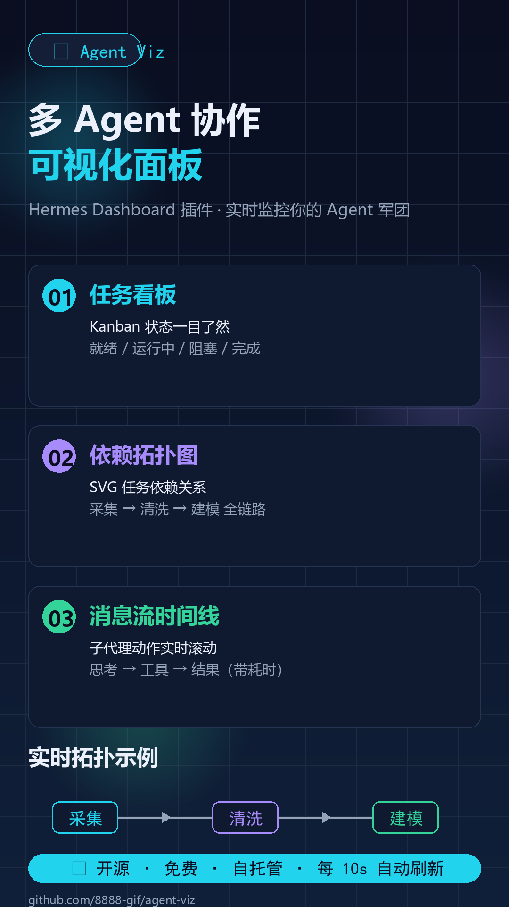

# Agent Viz — 多 Agent 协作可视化

一个 **Hermes web dashboard 插件**，把多 Agent 协作过程可视化：任务看板、实时 Agent 状态、任务依赖拓扑图、子代理消息流。



## 功能

| 视图 | 内容 |
|---|---|
| **总览** | 统计卡片（活动 Agent / 任务总数 / 已完成）+ **全部 Agent 工作状态军团视图**（每个 agent 状态分布条）+ 实时 Agent 状态 + 活动流 + Kanban 看板 |
| **拓扑图** | 任务依赖关系 SVG 图（自动分层布局、状态配色、贝塞尔依赖箭头、**自适应网格、缩放/平移、只看运行中过滤**） |
| **消息流** | 子代理动作泳道时间线（**按子代理分组**、可折叠、带耗时） |
| **爬取进度** | 原材料厂家爬取项目进度总览（**动态扫描数据目录**、状态分布条、筛选、**⚙ 设置路径**、**＋ LLM 智能导入**、**⬇ CSV 导出**、**⚡ LLM 深度导出**） |

数据每 10 秒自动刷新。

## 数据来源

- `~/.hermes/kanban.db` — Kanban 任务 / 依赖 / 事件
- `~/.hermes/cache/delegation/live/` — 子代理实时日志（live_transcripts）
- `~/.hermes/state.db` — 会话记录
- 爬取进度数据目录（默认 `D:\AI\codex_skill`，可在前端 ⚙ 设置路径 修改）

## 安装

```bash
# 1. 把插件目录放到 Hermes 插件目录
cp -r agent-viz ~/.hermes/plugins/

# 2. 启用插件（config.yaml 的 plugins.enabled 加入 agent-viz）
```

启用后启动 dashboard：

```bash
unset HERMES_DESKTOP HERMES_WEB_DIST HERMES_SERVE_HEADLESS
hermes dashboard
```

浏览器打开 `http://127.0.0.1:9119/agent-viz`。

## 目录结构

```
agent-viz/
├── dashboard/
│   ├── manifest.json      # 插件配置（tab 路径、入口、后端 API）
│   ├── plugin_api.py      # 后端 FastAPI 路由（读 Hermes 内部数据）
│   └── dist/
│       ├── index.js       # 前端 UI（Plugin SDK，IIFE 无构建）
│       └── style.css      # 样式
├── docs/
│   └── hermes-dashboard-plugin.md   # 插件开发完整指南（含踩坑记录）
└── assets/
    └── banner.png         # 宣传图
```

## 后端 API

| 端点 | 说明 |
|---|---|
| `/api/plugins/agent-viz/health` | 健康检查 |
| `/api/plugins/agent-viz/board` | Kanban 看板（按状态分组） |
| `/api/plugins/agent-viz/agents` | 实时 Agent 状态（kanban + 子代理） |
| `/api/plugins/agent-viz/activity` | 活动流（transcript 尾部 + kanban 事件） |
| `/api/plugins/agent-viz/topology` | 任务依赖拓扑图数据 |
| `/api/plugins/agent-viz/flow` | 子代理消息流（结构化事件） |

## 开发踩坑记录

完整指南见 [docs/hermes-dashboard-plugin.md](docs/hermes-dashboard-plugin.md)，关键点：

1. **SDK 的 Tabs 是 render-prop 模式**（children 是函数 `(value, setValue)`），不是受控组件——用错整个 dashboard 白屏
2. 用户插件必须加入 `config.yaml` 的 `plugins.enabled`，否则不加载
3. `hermes config set` 会把数组存成字符串，需用 Python yaml 直接改
4. 桌面 App 环境变量（`HERMES_WEB_DIST`）会劫持 dashboard，需 unset

## 技术栈

- **后端**：FastAPI（Hermes dashboard 插件路由）
- **前端**：Hermes Plugin SDK（React + shadcn 组件，IIFE 无构建步骤）
- **数据**：SQLite（kanban.db / state.db）+ 日志解析

---

Built with [Hermes Agent](https://hermes-agent.nousresearch.com/) · 多 Agent 协作可视化
